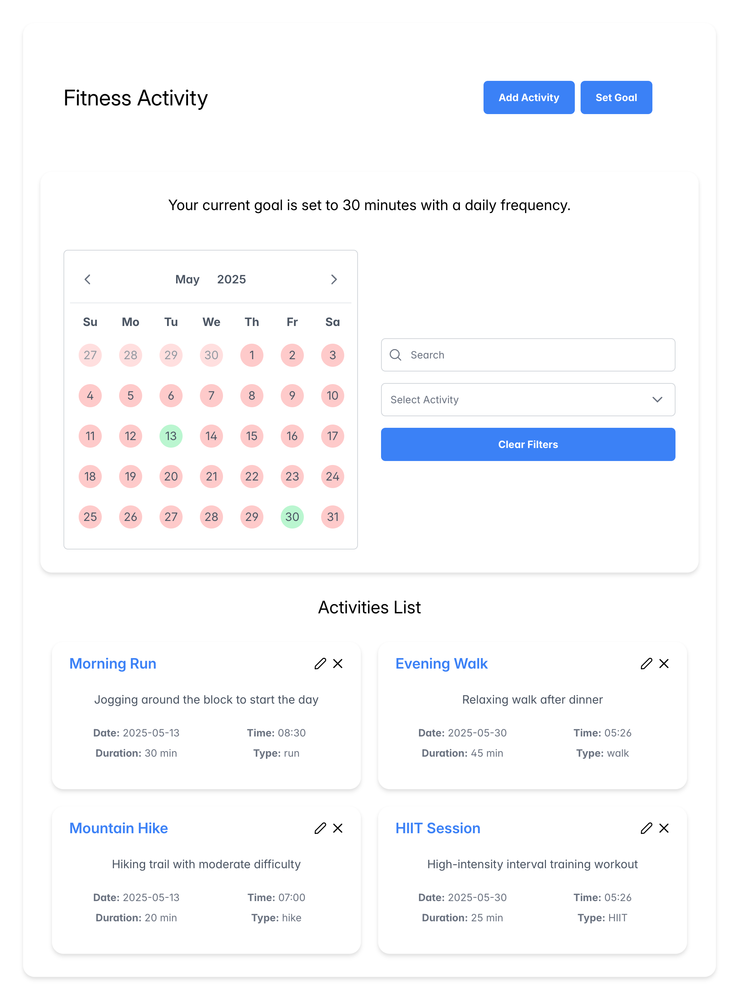
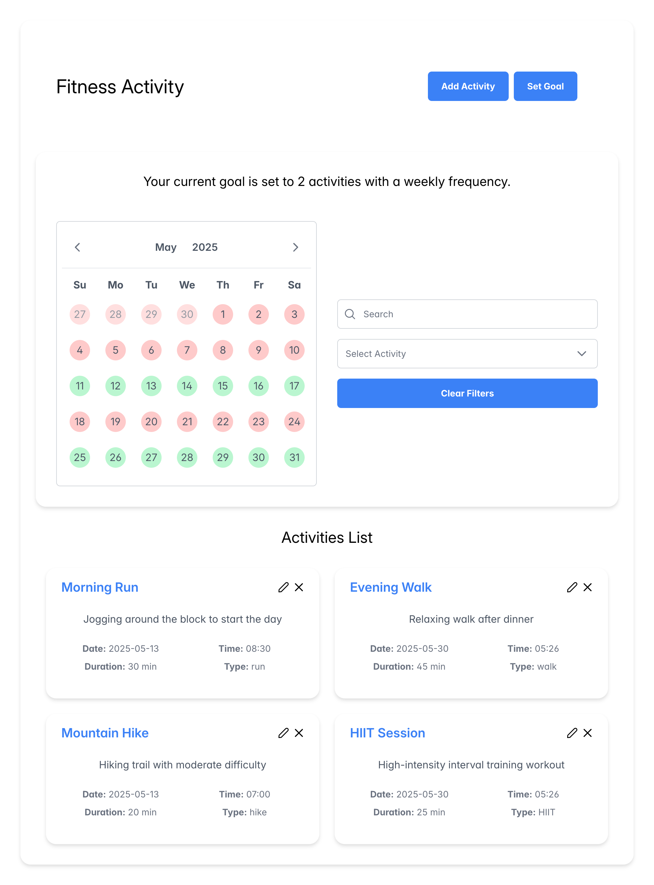
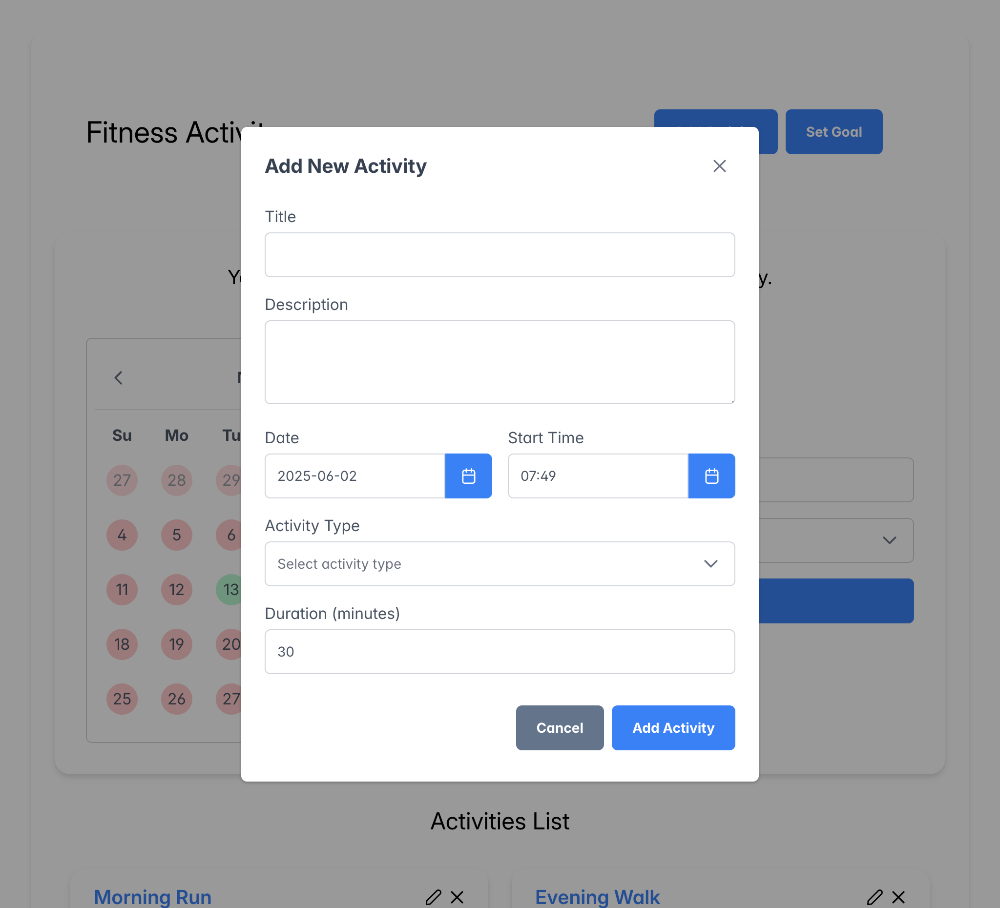
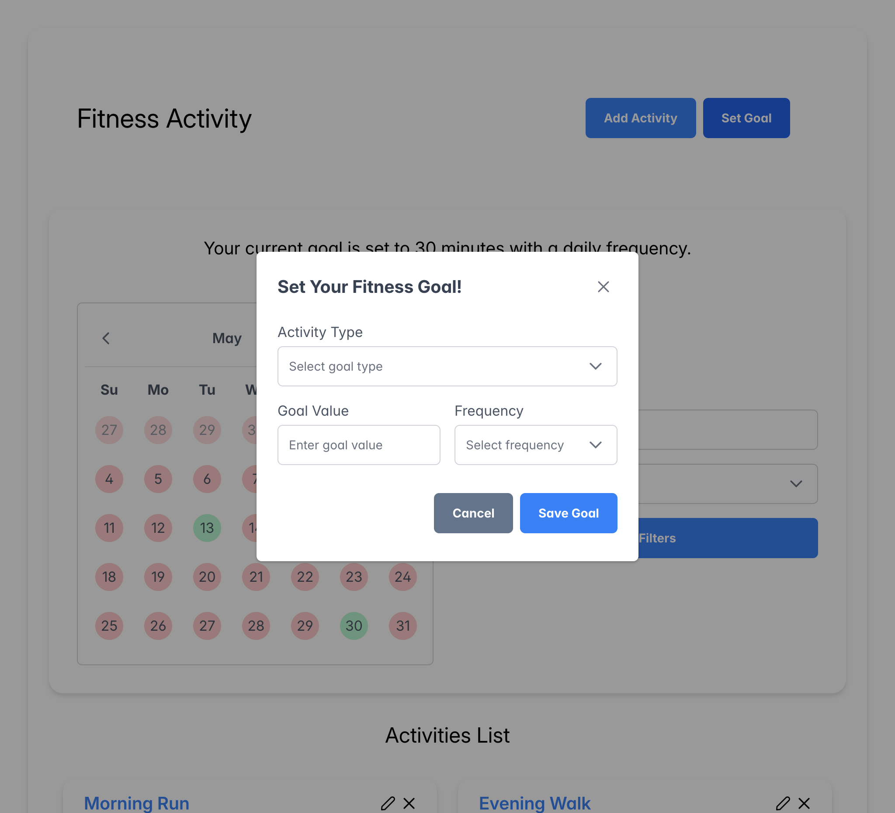
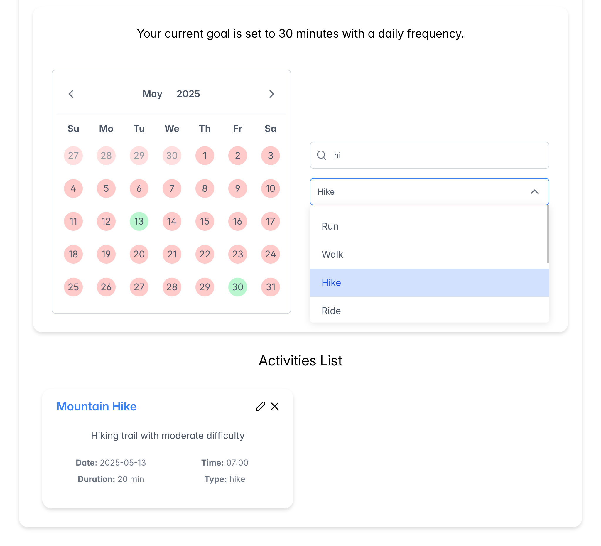
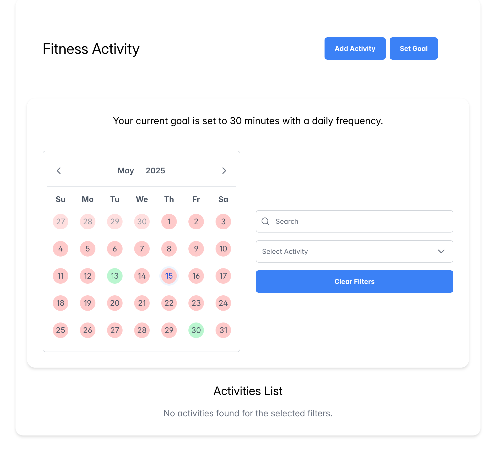
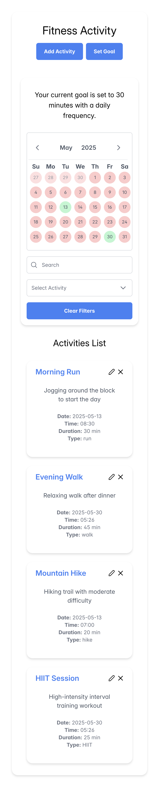
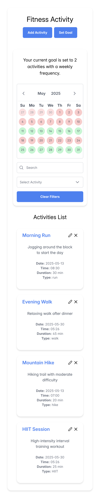
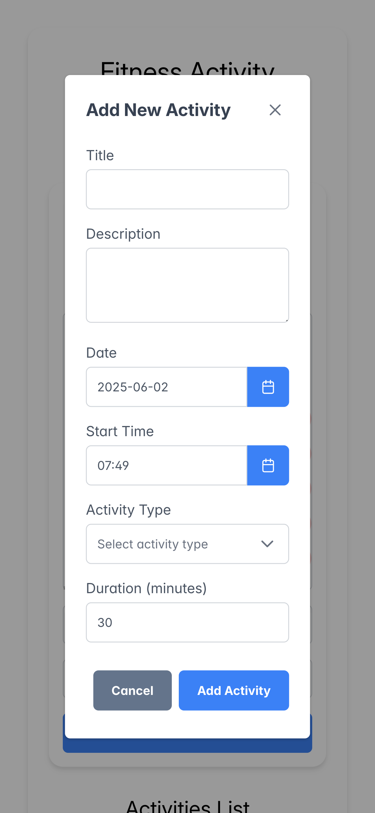
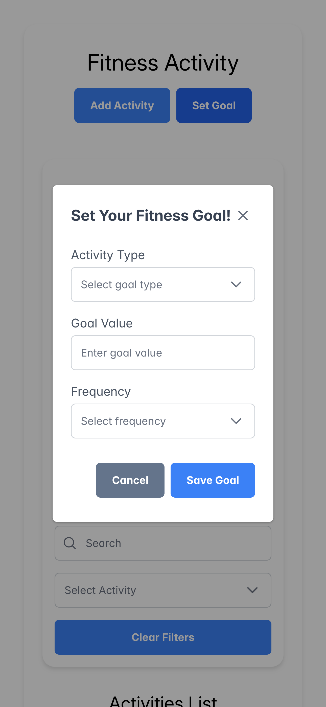

# Fitness Activity App

A simple fitness goal and activity tracking application built with **React** and **TypeScript**. Users can add, edit, and filter their daily or weekly goals and track their progress using a calendar-based UI.

---

## Tech Stack

- **React**
- **TypeScript**
- **Vite**
- **React Hook Form**
- **React Query**
- **PrimeReact**
- **Tailwind CSS**
- **Moment.js**

## Install Dependencies and Start App

```bash
npm install
npm run start
```

## JSON Server (Mock Backend)

This project uses **JSON Server** as a mock REST API.

To run only backend (if needed):

```bash
npx json-server --watch db.json --port 3001
```

Make sure that `db.json` is located in the project root directory. This file stores your mock data for activities and goals.

---

## Screenshots Desktop

### Full Page Daily Goal



---

### Full Page Weekly Goal



---

### Add Activity Dialog



---

### Set Goal Dialog



---

### Filters



---

### No Activities on Selected Date



---

## Screenshots Mobile

<p align="center">
  
  
</p>

<p align="center">
  
  
</p>
